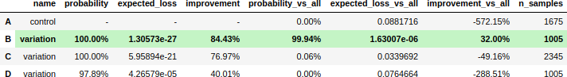
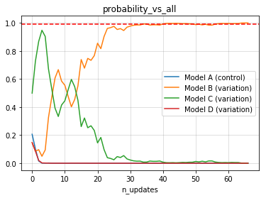
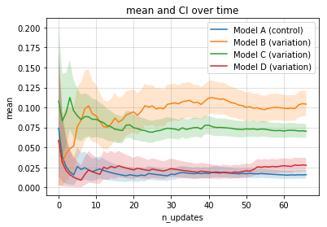

======
CPrior
======

.. image::  https://travis-ci.com/guillermo-navas-palencia/cprior.svg?branch=master
   :target: https://travis-ci.com/guillermo-navas-palencia/cprior

.. image::  https://codecov.io/gh/guillermo-navas-palencia/cprior/branch/master/graph/badge.svg
   :target: https://codecov.io/gh/guillermo-navas-palencia/cprior

.. image::  https://img.shields.io/github/license/guillermo-navas-palencia/cprior
   :target: https://img.shields.io/github/license/guillermo-navas-palencia/cprior

.. image:: https://img.shields.io/pypi/v/cprior?color=blue
   :target: https://img.shields.io/pypi/v/cprior?color=blue 

.. image:: https://pepy.tech/badge/cprior
   :target: https://pepy.tech/project/cprior

**CPrior** has functionalities to perform Bayesian statistics and running A/B and multivariate testing. CPrior includes several conjugate prior distributions and has been developed focusing on performance, implementing many closed-forms in terms of special functions to obtain fast and accurate results, avoiding Monte Carlo methods whenever possible.

**Website**: http://gnpalencia.org/cprior/

Installation
------------

To install the current release of CPrior on Linux/Windows:

.. code-block:: bash

    pip install cprior

For different OS and/or custom installations, see http://gnpalencia.org/cprior/getting_started.html.

Dependencies
""""""""""""

CPrior has been tested with CPython 3.5, 3.6 and 3.7. It requires:

* mpmath 1.0.0 or later. Website: http://mpmath.org/
* numpy 1.15.0 or later. Website: https://www.numpy.org/
* scipy 1.0.0 or later. Website: https://scipy.org/scipylib/
* pytest
* coverage

Testing
"""""""
Run all unit tests

.. code-block:: bash

   python setup.py test

Examples
--------

Example: run experiment
"""""""""""""""""""""""

A Bayesian multivariate test with control and 3 variants. Data follows a
Bernoulli distribution with distinct success probability.

1. Generate control and variant models and build experiment. Select stopping rule and threshold (epsilon).

.. code-block:: python
   
   from scipy import stats
   from cprior.models.bernoulli import BernoulliModel
   from cprior.models.bernoulli import BernoulliMVTest
   from cprior.experiment.base import Experiment
   
   modelA = BernoulliModel(name="control", alpha=1, beta=1)
   modelB = BernoulliModel(name="variation", alpha=1, beta=1)
   modelC = BernoulliModel(name="variation", alpha=1, beta=1)
   modelD = BernoulliModel(name="variation", alpha=1, beta=1)

   mvtest = BernoulliMVTest({"A": modelA, "B": modelB, "C": modelC, "D": modelD})

   experiment = Experiment(name="CTR", test=mvtest, stopping_rule="probability_vs_all",
                           epsilon=0.99, min_n_samples=1000, max_n_samples=None)

2. See experiment description

.. code-block:: python

   experiment.describe()
   
.. code-block:: txt

   =====================================================
     Experiment: CTR
   =====================================================
       Bayesian model:                bernoulli-beta
       Number of variants:                         4

       Options:
         stopping rule            probability_vs_all
         epsilon                             0.99000
         min_n_samples                          1000
         max_n_samples                       not set

       Priors:

            alpha  beta
         A      1     1
         B      1     1
         C      1     1
         D      1     1
     -------------------------------------------------
   
3. Generate or pass new data and update models until a clear winner is found. The stopping rule will be updated after a new update.

.. code-block:: python

   with experiment as e:
       while not e.termination:
           data_A = stats.bernoulli(p=0.0223).rvs(size=25)
           data_B = stats.bernoulli(p=0.1128).rvs(size=15)
           data_C = stats.bernoulli(p=0.0751).rvs(size=35)
           data_D = stats.bernoulli(p=0.0280).rvs(size=15)

           e.run_update(**{"A": data_A, "B": data_B, "C": data_C, "D": data_D})

       print(e.termination, e.status)

.. code-block:: txt
   
   True winner B

4. Reporting: experiment summary

.. code-block:: python

   experiment.summary()

5. Reporting: visualize stopping rule metric over time (updates)

.. code-block:: python

   experiment.plot_metric()

6. Reporting: visualize statistics over time (updates)

.. code-block:: python

   experiment.plot_stats()

Example: basic A/B test
"""""""""""""""""""""""

A Bayesian A/B test with data following a Bernoulli distribution with two
distinct success probability. This example is a simple use case for
CRO (conversion rate) or CTR (click-through rate) testing.

.. code-block:: python

   from scipy import stats

   from cprior.models import BernoulliModel
   from cprior.models import BernoulliABTest

   modelA = BernoulliModel()
   modelB = BernoulliModel()

   test = BernoulliABTest(modelA=modelA, modelB=modelB)

   data_A = stats.bernoulli(p=0.10).rvs(size=1500, random_state=42)
   data_B = stats.bernoulli(p=0.11).rvs(size=1600, random_state=42)

   test.update_A(data_A)
   test.update_B(data_B)

   # Compute P[A > B] and P[B > A]
   print("P[A > B] = {:.4f}".format(test.probability(variant="A")))
   print("P[B > A] = {:.4f}".format(test.probability(variant="B")))

   # Compute posterior expected loss given a variant
   print("E[max(B - A, 0)] = {:.4f}".format(test.expected_loss(variant="A")))
   print("E[max(A - B, 0)] = {:.4f}".format(test.expected_loss(variant="B")))

The output should be the following:

.. code-block::

   P[A > B] = 0.1024
   P[B > A] = 0.8976
   E[max(B - A, 0)] = 0.0147
   E[max(A - B, 0)] = 0.0005